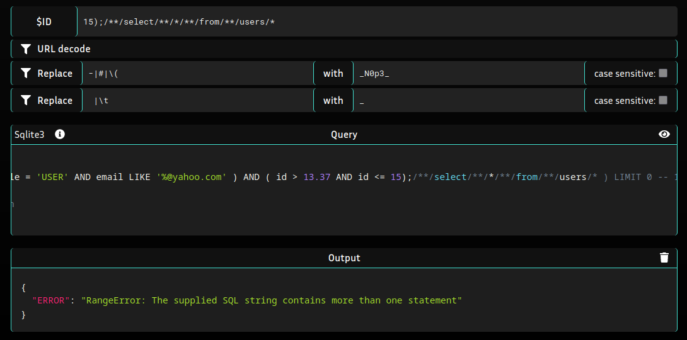
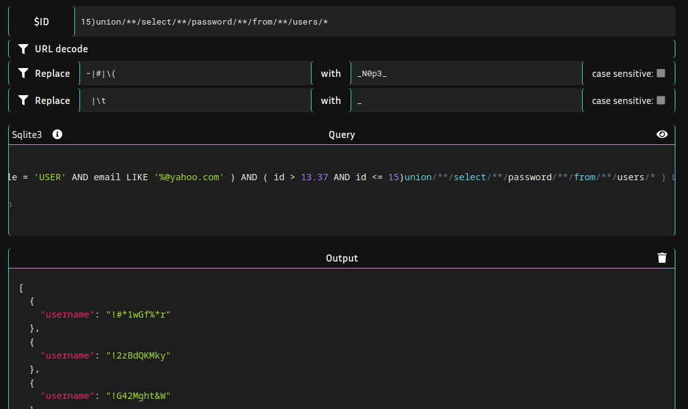
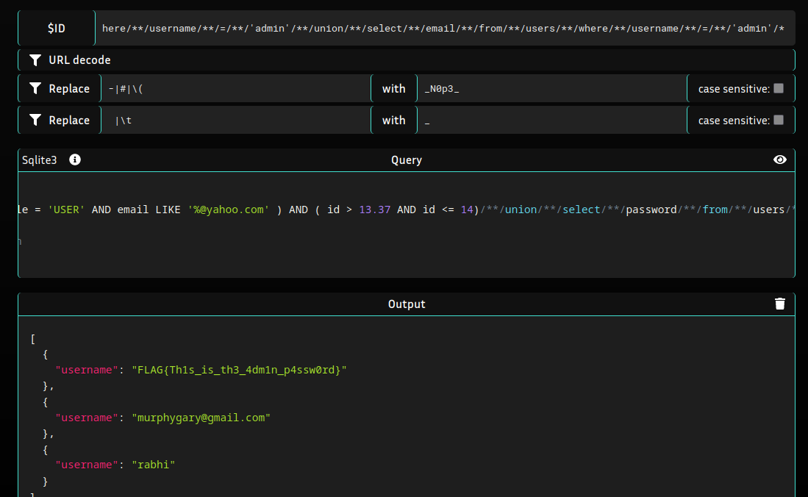

# SQL injection in parameter $ID leading to data extraction
## Description of the vulnerability
A SQL injection is the process where the user will inject code instead of the desired value in an input (like a GET parameter) in order to modify directly a SQL query which take for parameter(s) the user input(s). It happen when users inputs aren't sanitized properly, resulting in the application processing the input directly as code instead as a string.
In the context of this challenge, the code processing the user input before the query is left public, allowing the attacker to bypass the input sanitization pretty easily.


The SQL injection was in the parameter $ID. Even if the code actually sanitized some specials characters to avoid injection, it was still possible to modify the SQL query and extract data.
The default SQL query look like this :
```sql
SELECT username FROM users WHERE ( role = 'USER' AND email LIKE '%@yahoo.com' ) AND ( id > 13.37 AND id <= $ID ) LIMIT 0
```
This query will return the usernames for all users with an email from yahoo.com, the role 'USER' and an id between 13.37 and the specified $ID
What we are usually interested in are admin credentials, and that's also the goal of the challenge. 
We will therefore inject a specific payload in $ID to edit the SQL query and extract admin credentials
##  Exploitation - steps to reproduce
Information about the source code are the following one : 


We cannot use characters like `-` or `#` to comment the rest of the query, we cannot use `(` to add a condition or a statement, and we cannot add space or tabulation. In theory, we cannot make a SQL query with all theses rules :


But, there is one major flaw in the sanitization process: characters like `/` and `*` aren't replaced. 
In effect, there is another way to comment in sqlite, with an opening `/*` and a closing `*/` (like in C/C++)This is used to comment multiple lines, so if you input only a `/*`, the rest of the line will be commented. We can test this by bypassing the `LIMIT O` in the original SQL query :


We get result because the `LIMIT 0` has been commented, otherwise the query would not return anything.
Now that we've gotten rid of this problem, we need to find a way to make a correct SQL statement without spaces.
And as I said earlier, you can open **and** close comments with `/` and `*`. So what if each term of the statement was delimited by a comments instead of a space : in effect, you can put comment **inside** the query with `/*comment*/`. 
A query like 
```sql
select * from users
```
would became 
```sql
select/**/*/**/from/**/users
```
Let's try it :



It worked ! The error happen only because we try to make a 2nd statement on the same line.One way to bypass this is by using the `UNION` keyword. It's used to combine the result of two or more SELECT statements. But the two SELECT statements need to output the same numbers of columns, and as the first statement return 1 column (username), we need to specify which column we are interested in. In our case, we can try the 'password' column. The payload will look like :
```sql
15) union select password from users/*
``` 
and after transformation to bypass sanitization :
```sql
15)union/**/select/**/password/**/from/**/users/*
``` 
Let's try it:



It worked, we get all the passwords of the column 'password'! Now we only need to precise that we want the password for the user `admin`, and also grab his email, and the challenge will be completed. 
## PoC

By using the following payload :
```sql
14)/**/union/**/select/**/password/**/from/**/users/**/where/**/username/**/=/**/'admin'/**/union/**/select/**/email/**/from/**/users/**/where/**/username/**/=/**/'admin'/*
```
I'm able to extract the password and the email address of the user `admin` :



## Risk
With this vulnerability, we can extract the credentials of any user, including the admin, which could be used to access privates resources or even a control panel in the case of the admin. 
## Remediation
The simplest way to close this breach is to add the characters `/` and `*` to the blacklist like the other ones, and the payload wouldn't work anymore. But as the input is an ID (so a number), you can even add a verification that the input is only made of digits and not alpha characters. This would prevent any injection.
## Conclusion
This was my first challenge on YesWeHack, and I must say the dojo interface is fun to play with. Thanks for it !
#### #YesWeRHackers