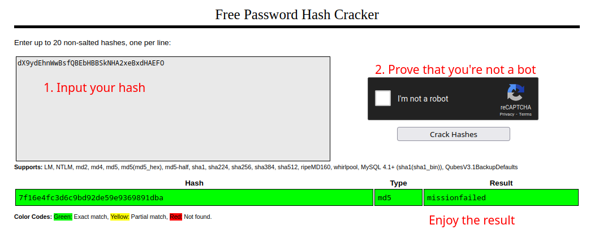
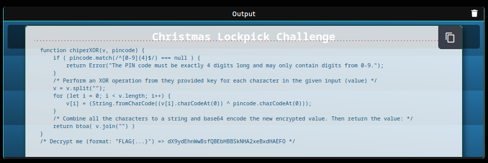
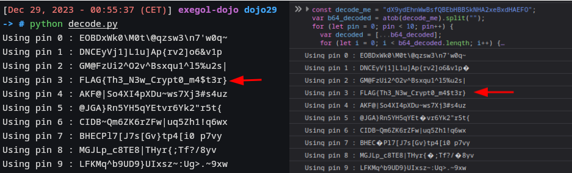
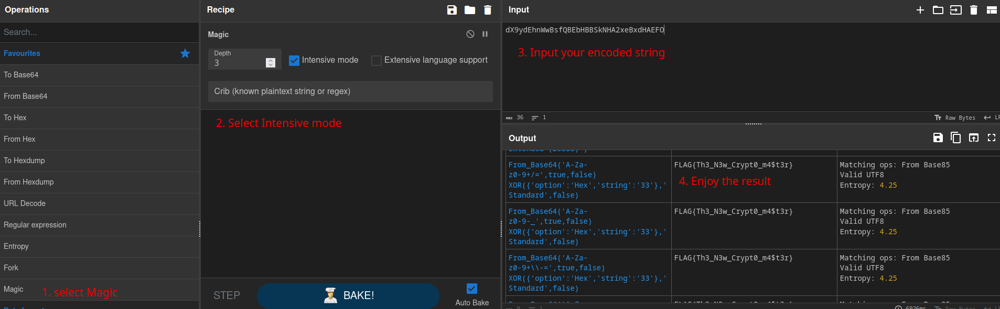

# Weak credentials (CWE-798) and weak encryption used (CWE-326) leading to information disclosure

## Description of the vulnerability

In this dojo, we actually find multiples weakness leading to the flag retrieval :

* [CWE-1391](https://cwe.mitre.org/data/definitions/1391.html) : a weak password is being used, and can be found inside a rainbow table 
* [CWE-326](https://cwe.mitre.org/data/definitions/326.html) : a weak hashing algorithm is being used (MD5), making the password more vulnerable to bruteforce attack
* [CWE-19](https://cwe.mitre.org/data/definitions/19.html) : the function used to encode the flag doesn't use the entire pincode provided, making it more vulnerable to bruteforce attack

Linking and using theses vulneraties lead to the retrieval of the encryption key of the vault, and once the encoding function has been reverse-engineered, it become possible to decode the secret phrase and capture the flag

## Exploitation – steps to reproduce

#### 1°/ analyzing the source code:

To start this dojo, we are given a HTML source code with a javascript function inside. If we take a look at the script part, we can find the source code for the vault used by Santa. Our only input is the variable `const key = ""` where we can input a decryption key to read the data inside the vault.
The code in itself is pretty simple :
```js
// Security vault with lock and unlock functionality for storing your most secret data!
class Vault {
    #isLocked = false
    #data = ""
    #key = null

    // MD5 Hash the given key and compare it with the stored vault key
    #MD5hash(key) { return CryptoJS.MD5(key).toString() };
    // Set a key for the vault and also the encrypter/decrypter
    setKey(key) { return ( this.#key === null ) ? this.#key = key : Error("key already set and cannot be changed!") };
    // Add a new data to the Vault (*vault must be unlocked*)
    setData(data) { this.#data = data };
    // Open the vault and return the stored data
    open() { return this.#data };

    // Lock the vault and encrypt the data it contains
    lock() {
        if ( this.#isLocked === false ) {
            try {
                let encryptedData = CryptoJS.AES.encrypt(this.#data, this.#key).toString()
                this.#data = encryptedData
                this.#isLocked = true
            } catch { return Error("invalid key or corrupted data in vault.") }
        }
    };
    // Unlock the vault and decrypt the data it contains
    unlock(key) {
        if ( this.#isLocked === true ) {
            try {
                let decryptData = CryptoJS.AES.decrypt(this.#data, this.#MD5hash(key)).toString(CryptoJS.enc.Utf8)

                if ( decryptData !== "" && decryptData !== this.#data ) {
                    this.#data = decryptData
                    this.#isLocked = false
                    return null
                } else {
                    return Error("could not unlock the vault!")
                }
            } catch {
                return Error("error when trying to decrypt the data")
            }
        }
    };
};
```
First, we can find the declaration of the class `Vault`. Rhe class `Vault` is used to define how the vault work, with it's different methods (or functions) like `setKey()`, `lock()`, `unlock()`... The vault can store some data and once locked, the data will be encrypted in AES (symmetric encryption algorithm) using an encryption key defined earlier.

Then we can find the part where a new vault is created and data is added inside :
```js
// Create a new vault (backup vault) to store our data in.
// When we have our vault, set a secret key that will lock the vault (I have to use the MD5 hash of the key because we forgot the actual key value...)
var vault = new Vault()
vault.setKey("7f16e4fc3d6c9bd92de59e9369891dba")
vault.lock()

// We only got the MD5 hash value of the key.
// I'm going to move this AES encrypted data from my other vault that uses the same key, so I'll add it as its AES encrypted state...
vault.setData("U2FsdGVkX1/SpGvO7gL9H5<snip>e67bVCJS11Z3fbc=")

// Let's take a guess!
const key = ""

// Check if we were able to unlock the vault with our guessed key:
error = vault.unlock(key)
```

#### 2°/ finding the weakness:

And that's where the magic happen ! If we believe the comment saying "_I have to use the MD5 hash of the key because we forgot the actual key value_", we know that the key is hashed using the [MD5 algorithm](https://en.wikipedia.org/wiki/MD5) :
```js
// When we have our vault, set a secret key that will lock the vault (I have to use the MD5 hash of the key because we forgot the actual key value...)
var vault = new Vault()
vault.setKey("7f16e4fc3d6c9bd92de59e9369891dba") // <- the key is here
```

It's very common to find this algorithm but it's also very weak, and should never be used for password hashing as it is now very fast to crack or to reverse using a [rainbow table](https://en.wikipedia.org/wiki/Rainbow_table). In fact, we can use the famous website [crackstation](https://crackstation.net/) to see if a password hash is present in one of thoses tables. It's always worth a try... And in this case, it was a good idea : the actual key value for the provided hash is found in crackstation database :


So the password would be : `missionfailed`... [not very secure](https://www.cisa.gov/secure-our-world/use-strong-passwords) :(

#### 3°/ reverse-engineering the encoding function:

Anyway, if we input the password in the variable :
```js
const key = "missionfailed"
```
and we run the script with it, we get the following output :


This is another javascript function, this time an encoding one : 
```js
function chiperXOR(v, pincode) {
    if ( pincode.match(/^[0-9]{4}$/) === null ) {
        return Error("The PIN code must be exactly 4 digits long and may only contain digits from 0-9.");
    }
    /* Perform an XOR operation from they provided key for each character in the given input (value) */
    v = v.split("");
    for (let i = 0; i < v.length; i++) {
        v[i] = (String.fromCharCode((v[i].charCodeAt(0)) ^ pincode.charCodeAt(0)));
    }
    /* Combine all the characters to a string and base64 encode the new encrypted value. Then return the value: */
    return btoa( v.join("") )
}
/* Decrypt me (format: "FLAG{...}") => dX9ydEhnWwBsfQBEbHBBSkNHA2xeBxdHAEFO */
```

Once again, we can analyse the code to find out how it work and decode the flag in the comment (last line) :

- This function take for input a string to encode and a pincode. 
- It will check if the pincode is made of 4 digit and continue if it is. 
- Then, for each character in the string, it will apply a XOR (OR exclusive) operation between the ASCII code of the character of the string and the ASCII code of the first digit of the pincode. 
- It will then reconstruct a string and encode it in base64 before returning it

As we have the encoding function, we just need to perform theses step in reverse order to find the input string and the flag. That mean base64 decoding it and then applying XOR operation for each character of the string. As we don't know the pincode used here, a bit of bruteforce is needed. The good thing for use is that the function only use the first digit of the pincode, so we don't need to bruteforce more than 10 values (0 to 9)

If first created the decoding function in python (my confort language, especially for cryptographic functions), but I also created the same version in javascript so you can test it directly in your browser :

<table>
  <tr>
    <td>javascript</td>
    <td>

      <pre>
<code>
const decode_me = "dX9ydEhnWwBsfQBEbHBBSkNHA2xeBxdHAEFO";
var b64_decoded = atob(decode_me).split(""); // base64 decode
for (let pin = 0; pin < 10; pin++) { // pin bruteforce
  var decoded = [...b64_decoded];
  for (let i = 0; i < b64_decoded.length; i++) {
    decoded[i] = String.fromCharCode(
      b64_decoded[i].charCodeAt(0) ^ pin.toString().charCodeAt(0) // apply XOR
    );
  }
  console.log("Using pin " + pin + " : " + decoded.join("")); // print decoded string
}
</code>
</pre>

    </td>
  </tr>
  <tr>
    <td>python</td>
    <td>

      <pre>
<code>
import base64

decrypt_me = "dX9ydEhnWwBsfQBEbHBBSkNHA2xeBxdHAEFO"
b64_decoded = str(base64.b64decode(decrypt_me).decode("utf-8")) # base64 decode
for pin in range(0,10): # pin bruteforce
    print(f"Using pin {pin} : ",end="")
    decoded = []
    for char in b64_decoded:
        c = ord(char) ^ ord(str(pin)) # apply XOR
        decoded.append(chr(c))
    print("".join(decoded)) # print decoded string
</code>
</pre>

    </td>
  </tr>
</table>

And the output is exactly the same :


## PoC 

Using a rainbow table to find the original value of the encryption key (`missionfailed`), I was able to find an encoded string and the corresponding encoding function. 
By reverse-engineering the function, I was able to bruteforoce the pincode used and find the cleartext value of the flag : 
```
Decoded flag : FLAG{Th3_N3w_Crypt0_m4$t3r}
```

### Bonus 

If you don't like coding or just to spare some times, it's also possible to find the cleartext value of the flag using the wonderful website https://cyberchef.org/ :


You can find the exact recipe [here](https://cyberchef.org/#recipe=Magic(3,true,false,'')&input=ZFg5eWRFaG5Xd0JzZlFCRWJIQkJTa05IQTJ4ZUJ4ZEhBRUZP)

(This is only possible because of the weak algorithm used here)

## How to prevent

Even if this time we helped him save Christmas, Santa should seriously improve his security. Here are some tips on how he could avoid this kind of problems :

* Use a better hashing algorithm. He can follow the [NIST guide](https://csrc.nist.gov/projects/hash-functions) to see which algorithm to use.
* Use a stronger password, all of this could have been prevented if the password followed [the best practice](https://www.cisa.gov/secure-our-world/use-strong-passwords) 
* The encoding function in itself is already pretty simple and weak, but it could be better if the whole pincode was used and not only the first digit. This could be fixed with theses new lines :
```js
// XOR each character of v with each digit of pincode
const encoded = [];
for (let i = 0; i < v.length; i++) {
    const vCharCode = v[i].charCodeAt(0);

    // XOR each character of v with each digit of pincode
    for (let j = 0; j < pincode.length; j++) {
        const pinCharCode = pincode.charCodeAt(j);
        encoded.push(String.fromCharCode(vCharCode ^ pinCharCode));
    }
}
```
This time, all four digits of the pincode are being used and the bruteforce would already be more complexe (10000 possibilities instead of 10). Of course this is an example and there are plenty of way of making this code more secure.

## Conclusion

Thanks for this challenge, thanks for the Dojo and everything and I'll see you in 2024 ❤️ !

#### #YesWeRHackers
